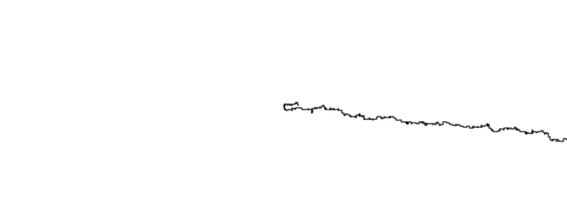
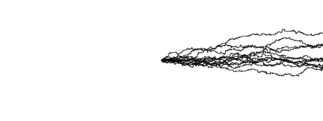

### Experimento
- Cambiar la probabilidad de las direcciónes, 50% para la derecha, 25% para arriba y 25% para abajo, adicionalmente reiniciar la posición cada vez que alcazara el límite del canvas.
  - **Función Modificada:**
``` js
step() 
  {
    const choice = floor(random(4));
    if(this.x > width || this.y > height)
    {
      this.x = width / 2;
      this.y = height / 2;
    }
    else
    {
      if (choice <= 1) 
      {
        this.x++;
      }
      else if (choice == 2)
      {
        this.y++;
      } 
      else 
      {
        this.y--;  
      }
    }
  }
  
  ```
  
- ¿Que tipo de forma empezará a surgir según el cambio del tiempo?
- Espero obtener una forma que se aproxime a la de un relámpago al con una o 2 iteraciones _(Veces que empieza desde el centro del canvas)_.
- **Resultados**: 1-(_Una Iteración_) 2-(_Más de 10 Iteraciones_)
  - 
  - 

- Aprendí el cómo el tiempo dentro de las simulaciones procedurales, no solo pueden, sino que van a cambiar drásticamente la imágen cuando se le da mucha libertad a estos valores aleatorios
