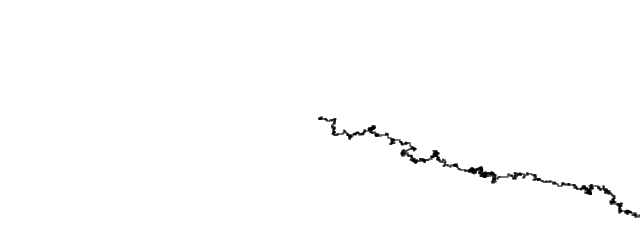

En la distribución uniforme la probabilidad de cada evento es la misma, mientras que en la no uniforme, puede haber una tendencia mayor o menor hacia uno o más eventos. En este caso, le di una mayot tendencia a ir a la derecha, una un poco menor para ir hacia la izquierda, otra un poco menor para ir hacia abajo y la menor, para subir.
- **Resultado:**



``` js
 step() 
  {
    const choice = floor(random(40));
    
    if (choice <= 15) 
    {
      this.x++;
    } 
    else if (choice > 15 && choice <= 25) 
    {
      this.x--;
    } 
    else if (choice > 25 && choice <= 33) 
    {
      this.y++;
    } 
    else 
    {
      this.y--;
    }
  }
``` 
