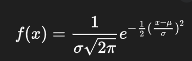
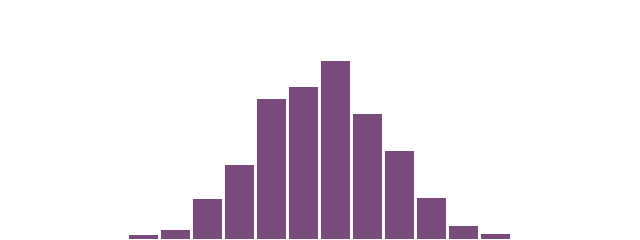

Lo primero es que revisamos la formula de la distribución gausiana, muy importante para modelar ecuaciones diferenciales ya que muchos comportamientos de la naturaleza imitan este patrón.
- Lo primero fue revisar al formula y los datos necesarios.
  


- **Código**: De referencia se tomó el código de [Example 0.2: A Random-Number Distribution](https://natureofcode.com/random/#example-02-a-random-number-distribution) 

``` js

// The Nature of Code
// Daniel Shiffman
// Modified for Gaussian Distribution

let randomCounts = [];
let total = 20;

// Mean and standard deviation for Gaussian distribution
const mean = 10;
const stdDev = 2;

function setup() {
  createCanvas(640, 240);
  for (let i = 0; i < total; i++) {
    randomCounts[i] = 0;
  }
}

function draw() 
{
  background(255);

  // Generate a Gaussian random number
  let gaussian = generateGaussian(mean, stdDev);

  // Map the Gaussian number to an index in the array
  let index = floor(gaussian);
  if (index >= 0 && index < total) 
  {
    randomCounts[index]++;
  }

  // Draw the histogram
  stroke(255);
  strokeWeight(2);
  fill(120, 75, 123);
  const w = width / randomCounts.length;

  for (let x = 0; x < randomCounts.length; x++) 
  {
    rect(x * w, height - randomCounts[x], w - 1, randomCounts[x]);
  }
}


```

- Hasta este punto iba bien, pero me compliqué un poco a la hora de calcular el cómo distribuir los números según la formula, por lo que me ayudé de ChatGPT para llegar al siguiente resultado:

``` js

// Function to generate a Gaussian random number using the Box-Muller Transform
function generateGaussian(mean, stdDev) 
{
  let u = 0, v = 0;
  while (u === 0) u = random(); // Avoid zero to prevent log(0)
  while (v === 0) v = random();
  let z = sqrt(-2.0 * log(u)) * cos(TWO_PI * v); // Box-Muller Transform
  return z * stdDev + mean; // Scale and shift
}


```

- Se utiliza el método de Box-Muller, el cual es un algoritmo que se utiliza para generar números aleatorios que siguen una distribución normal (o distribución Gaussiana) a partir de números aleatorios que siguen una distribución uniforme.
- **Resultado**:


