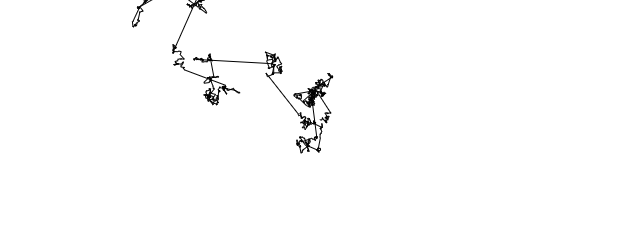

- Por lo que puedo comprender del concepto del vuelo de Levy, es un algoritmo que ayuda a simular o representar algunos comportamientos de la naturaleza, como por ejemplo la ruta que toman algunos animales a la hora de buscar comida, o el comportamiento del precio de acciones de una empresa en el mercado.
- Me parecería interesante usarlo como un añadido en el shader del agua, para poder generar algunos animales con movimiento sin necesidad de instaciar entidades individuales, adicionalmente esto podría generarse de manera procedural, para no solo poder modificar parametros relacionas al vuelo de Levy, sino tambi´ne parametros visuales como la densidad de animales generados y su variedad

