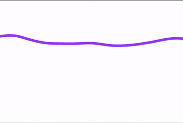

- Comprendo el Ruido de Perlin como un generador de números aleatorios de maenra controlada, es decir, establece ciertos parametros dentro de estos para que los números que generan, estén relativamente cerca del anterior, generando tranciones más suaves entre estos números aleatorios. Como se puede observar en [la figura de la pagina de referencia](https://natureofcode.com/random/#a-smoother-approach-with-perlin-noise).

- Modifiqué en el código el aumento del valor **t** para aumentar la velocidad de la simulación, después multipliqué por 0.1 la variable **xoff** para hacer que se generaran valores más estables y cambié el color del trazo dependiendo del valor del ruido de perlin:

``` js
let t = 0.0;

function setup() 
{
  createCanvas(360*2, 240*2);
}

function draw()
{
  background(255);
  let xoff = t;
  noFill();
  strokeWeight(10);
  beginShape();
  
  for (let i = 0; i < width; i++)
  {
    let y = noise(xoff*0.1) * height;
    xoff += 0.01;
    vertex(i, y);
    stroke(y, y/2, y*2);
  }
  
  endShape();
  t += 0.05;
}

```

**Resultado**


