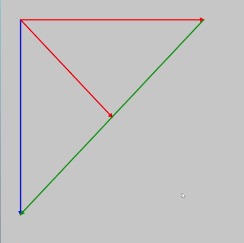

## [Puedes probar mi implementación dando click aquí!!](https://editor.p5js.org/Adept-KeyCap/full/BlCZG9-iu)

```js

let t = 0; // Interpolation value
let speed = 0.01; // Oscillation speed
let direction = 1; // Controls whether it goes up or down

function setup() {
    createCanvas(600, 600);
}

function draw() {
    background(200);
  
    let v0 = createVector(50, 50);
    let v1 = createVector(mouseX, 0);
    let v2 = createVector(0, mouseY);
  
  // Since the "drawArrow" function uses the "translate" method to change the origin,
  // vectors must be created with respect to the Canvas and not their local position
    let v3 = createVector(mouseX + 50, 50);
    let v4 = createVector(-mouseX , mouseY);

    let interpolatedValue = valueOscillator(t, speed);
    let v5 = createVector(mouseX/2 , mouseY/2);

    drawArrow(v0, v1, 'red');
    drawArrow(v0, v2, 'blue');
    drawArrow(v0, v5, lerpColor('red', 'blue', interpolatedValue));
    drawArrow(v3, v4, 'rgb(0,145,0)');
}

function drawArrow(base, vec, myColor) {
    push();
    stroke(myColor);
    strokeWeight(3);
    fill(myColor);
    translate(base.x, base.y);
    line(0, 0, vec.x, vec.y);
    rotate(vec.heading());
    let arrowSize = 7;
    translate(vec.mag() - arrowSize, 0);
    triangle(0, arrowSize / 2, 0, -arrowSize / 2, arrowSize, 0);
    pop();
}


```

- Decidí aprovechar la estructura que ya existía y siguendo la lógica de dodne pivotaban los vectores, decidí cambiar solamente los valores de los que dependían los pivortes de los vectores, por ejemplo el **vector rojo v1** solo quería que cambiara su magnitud entonces le pasé el **valor en X del cursor del mouse**, lo mismo con el v2 pero en el eje Y, y así dependiendo de donde quería que acabara su posición, o mejor dicho, de que posición yo quería que dependiera.

  
