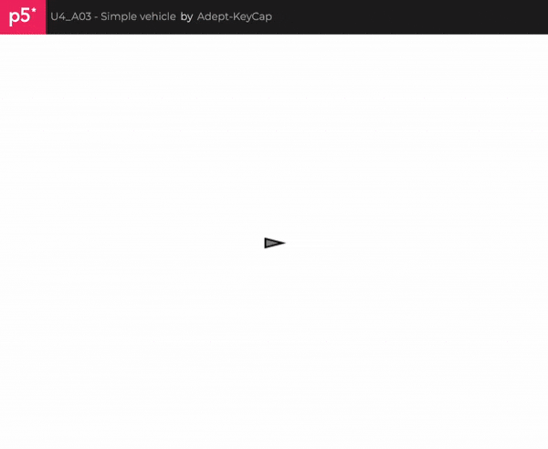

### [Simulación del vehículo simple](https://editor.p5js.org/Adept-KeyCap/full/DsKs6f0qE)
```js
//mover.js

class Vehicle {
  constructor() {
    this.position = createVector(width / 2, height / 2);
    this.velocity = createVector(0, 0);
    this.acceleration = createVector(0, 0);
    this.topspeed = 4;
    this.angle = 0;
  }

  applyForce(force) {
    this.acceleration.add(force);
  }

  update() {
    this.velocity.add(this.acceleration);
    this.velocity.limit(this.topspeed);
    this.position.add(this.velocity);
    this.acceleration.mult(0);
    
    if (this.velocity.mag() > 0.1) {
      this.angle = this.velocity.heading();
    }
  }

  display() {
    push();
    translate(this.position.x, this.position.y);
    rotate(this.angle);
    fill(127);
    stroke(0);
    strokeWeight(2);
    
    beginShape();
    vertex(10, 0);
    vertex(-10, 5);
    vertex(-10, -5);
    endShape(CLOSE);
    
    pop();
  }

  checkEdges() {
    if (this.position.x > width) this.position.x = 0;
    if (this.position.x < 0) this.position.x = width;
    if (this.position.y > height) this.position.y = 0;
    if (this.position.y < 0) this.position.y = height;
  }
}


// sketch.js

let vehicle;

function setup() {
  createCanvas(640, 480);
  vehicle = new Vehicle();
}

function draw() {
  background(255);

  if (keyIsDown(LEFT_ARROW)) {
    vehicle.applyForce(createVector(-0.1, 0));
  }
  if (keyIsDown(RIGHT_ARROW)) {
    vehicle.applyForce(createVector(0.1, 0));
  }
  if (keyIsDown(UP_ARROW)) {
    vehicle.applyForce(createVector(0, -0.1));
  }
  if (keyIsDown(DOWN_ARROW)) {
    vehicle.applyForce(createVector(0, 0.1));
  }

  vehicle.update();
  vehicle.checkEdges();
  vehicle.display();
}
```



