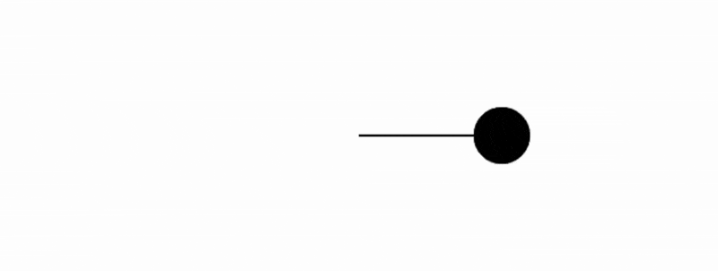

### [Prueba la simulación Aquí](https://editor.p5js.org/Adept-KeyCap/full/hgv5i91n3)
### Controles:
  - Flechas izquierda y derecha dismunuye y aumenta el periodo.
  - Felchas abajo y arriba dimunuye y aumenta la amplitud.
```js

let period = 120;
let amplitude = 200;
let phase = 0;

function setup() {
  createCanvas(640, 240);
}

function draw() {
  background(255);
  
  let x = amplitude * sin( ((TWO_PI * frameCount) / period));
  let x2 = amplitude * sin( ((TWO_PI * frameCount) / period) + phase);

  stroke(0);
  strokeWeight(2);
  translate(width / 2, height / 2);

  fill(127);
  line(0, 0, x, 0);
  circle(x, 0, 48);
  
  fill(0);
  line(0, 0, x2, 0);
  circle(x2, 0, 48);  
  
  if (keyIsDown(LEFT_ARROW)) {
    period -= 1;
  }
  if (keyIsDown(RIGHT_ARROW)) {
    period += 1;
  }
  if (keyIsDown(UP_ARROW) && amplitude < 200) {
    amplitude += 15;
  }
  if (keyIsDown(DOWN_ARROW) && amplitude > 0) {
    amplitude -= 15;
  }
}

function keyPressed(){
  phase += TWO_PI/360;  
}

```

