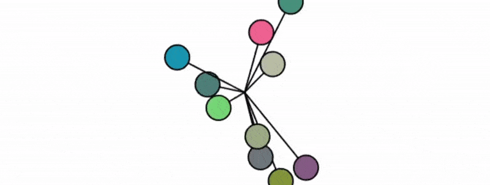

### [Prueba la simulación aquí](https://editor.p5js.org/Adept-KeyCap/full/eYr4z_2Gt)

**Sketch.js**
```js
let oscillators = [];

function setup() {
  createCanvas(640, 240);
  for (let i = 0; i < 10; i++) {
    oscillators.push(new Oscillator());
  }
}

function draw() {
  background(255);

  for (let osc of oscillators) {
    let force = createVector(random(-0.01, 0.01), random(-0.01, 0.01));
    osc.applyForce(force);
    osc.update();
    osc.show();
  }
}
```

**Oscilator.js**
```js
class Oscillator {
  constructor() {
    this.angle = createVector();
    this.angleVelocity = createVector(random(-0.05, 0.05), random(-0.05, 0.05));
    this.amplitude = createVector(random(20, width / 2), random(20, height / 2));

    this.color = color(
      constrain(randomGaussian(127, 50), 0, 255),
      constrain(randomGaussian(127, 50), 0, 255),
      constrain(randomGaussian(127, 50), 0, 255)
    );

    this.velocity = createVector(0, 0);
    this.acceleration = createVector(0, 0);
    this.frictionCoef = 0.02; // Coeficiente de fricción
  }

  applyForce(force) {
    this.acceleration.add(force);
  }

  update() {
    this.velocity.add(this.acceleration);

    // Aplicar fricción: es opuesta a la velocidad
    let friction = this.velocity.copy();
    friction.mult(-1); // Dirección opuesta
    friction.mult(this.frictionCoef);
    this.velocity.add(friction);

    this.angle.add(this.velocity);
    this.acceleration.mult(0); // Reiniciar fuerzas
  }

  show() {
    let x = sin(this.angle.x) * this.amplitude.x;
    let y = sin(this.angle.y) * this.amplitude.y;

    push();
    translate(width / 2, height / 2);
    stroke(0);
    strokeWeight(2);
    fill(this.color);
    line(0, 0, x, y);
    circle(x, y, 32);
    pop();
  }
}
```


