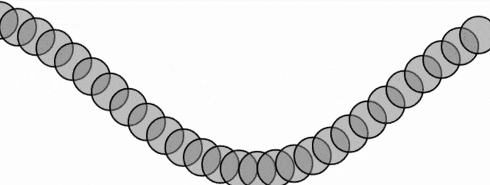

### [Link de la simulación](https://editor.p5js.org/Adept-KeyCap/full/Ij6lqn_yX)

  - Usamos un ciclo ```For``` cada frame para poder calcular el cambio, donde le sumamos a ```angle``` una variable llamada ```xOffset```, para poder ver el cambio de la función con respecto al ángulo. 

```js

let angle = 0;
let angleVelocity = 0.2;
let amplitude = 100;
let phase = 0; // Desfase para el movimiento de ola

function setup() {
  createCanvas(640, 240);
}

function draw() {
  background(255);
  stroke(0);
  strokeWeight(2);
  fill(127, 127);

  let xOffset = phase; // Permite el movimiento de la onda

  for (let x = 0; x <= width; x += 24) {
    let y = amplitude * sin(angle + xOffset);
    circle(x, y + height / 2, 48);
    xOffset += 0.2; // Ajusta la diferencia de fase entre puntos
  }

  phase += 0.05; // Hace que la onda se desplace horizontalmente
}


```


