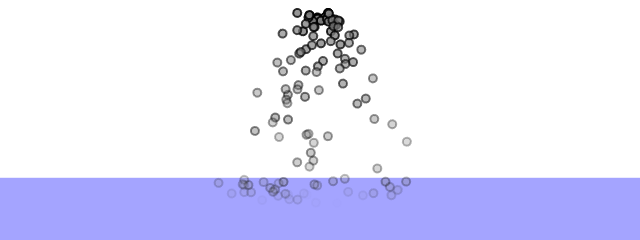
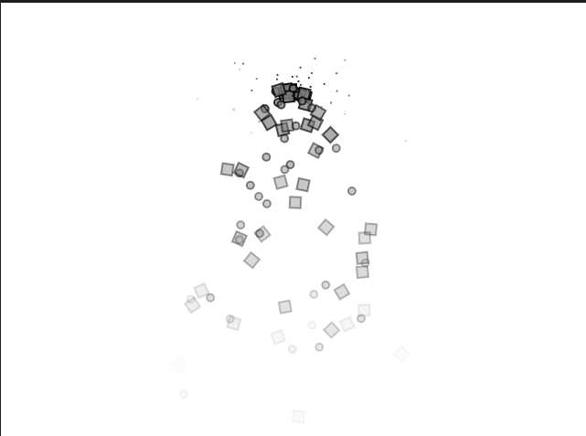

## 4.2:
particle.js
```js
class Particle {
  constructor(x, y) {
    this.position = createVector(x, y);
    this.acceleration = createVector(0, 0);
    this.velocity = createVector(random(-1, 1), random(-1, 0));
    this.lifespan = 255.0;
  }

  run() {
    let gravity = createVector(0, 0.05);
    this.applyForce(gravity);
    this.update();
    this.show();
  }

  applyForce(force) {
    this.acceleration.add(force);
  }

  // Method to update position
  update() {
    this.velocity.add(this.acceleration);
    this.position.add(this.velocity);
    this.lifespan -= 2;
    this.acceleration.mult(0);
  }

  // Method to display
  show() {
    stroke(0, this.lifespan);
    strokeWeight(2);
    fill(127, this.lifespan);
    circle(this.position.x, this.position.y, 8);
  }

  
  calculateDrag(coefficient) {
        let speed = this.velocity.mag();
        let dragMagnitude = coefficient * speed * speed;
        let dragForce = this.velocity.copy().mult(-1);
        dragForce.setMag(dragMagnitude);
        return dragForce;
  }
  
  // Is the particle still useful?
  isDead() {
    return (this.lifespan < 0.0);
  }
}

```

sketch.js
```js
let particles = [];
let waterLevel;

function setup() {
  createCanvas(640, 240);
  waterLevel = height/1.35;
}

function draw() {
  background(255);
  
   // Dibujar "agua"
    fill(100, 100, 255, 150);
    rect(0, waterLevel, width, height - waterLevel);
  
  particles.push(new Particle(width / 2, 20));

  // Looping through backwards to delete
  for (let i = particles.length - 1; i >= 0; i--) {
    let particle = particles[i];
    particle.run();
    
    if (particle.position.y > waterLevel) {
      let drag = particle.calculateDrag(0.2); // Coeficiente de arrastre
        particle.applyForce(drag);
    }
    
    if (particle.isDead()) {
      //remove the particle
      particles.splice(i, 1);
    }
  }
}
```

- En este ejemplo y en los siguientes lo que se hace para manejar la memoria, es que se usa la función ```splice()```, la cual lo saca del arreglo por lo que la función ```Draw()``` no vuelve a itreral por el, pero no me queda claro si P5.js se encarga de eliminar de la memoria el objeto o si el objeto sigue existiendo pero no se accede a él.
- En esta simulación apliqué el concepto de resistencia en diferentes medios, específicamente, el agua, donde las partículas desaceleran al momento de entrar a este nuevo medio.

  

### [Link de la simulación](https://editor.p5js.org/Adept-KeyCap/full/7KWghXoAb)

## 4.4:
sketch.js
```js
let emitters = [];
let attractor;

let gravityStrenght = 1;

function setup() {
  createCanvas(640, 240);
  let text = createP("click to add particle systems");
  attractor = new Attractor((width / 2, height / 2), 40);
}

function draw() {
  background(255);
  
  attractor.show();
  
  for (let emitter of emitters) {
    emitter.run();
    emitter.addParticle();
    
    for (let particle of emitter.particles){
      let force = attractor.attract(particle);
      particle.applyForce(force);
    }
    
  }
}

function mousePressed() {
  emitters.push(new Emitter(mouseX, mouseY));
}

```

attractor.js
```js
class Attractor {
  constructor() {
    this.position = createVector(width / 2, height / 2);
    this.mass = 20;
  }

  attract(particle) {
    // dirección de la fuerza
    let force = p5.Vector.sub(this.position, particle.position);
    // distancia entre los objetos
    let distance = force.mag();
    // limitar la distancia para establecer área efectiva de la gravedad
    distance = constrain(distance, 5, 20);

    // magnitud de la fuerza gravitacional
    let strength = (gravityStrenght * this.mass * particle.mass) / (distance * distance);
    // obtener el vector de fuerza
    force.setMag(strength);
    return force;
  }

  show() {
    strokeWeight(0);
    stroke(0);
    fill(0, 255);
    circle(this.position.x, this.position.y, this.mass * 2);
  }
}
```

emitter.js
```js
class Emitter {
  constructor(x, y) {
    this.origin = createVector(x, y);
    this.particles = [];
  }

  addParticle() {
    this.particles.push(new Particle(this.origin.x, this.origin.y));
  }

  run() {
    // Looping through backwards to delete
    for (let i = this.particles.length - 1; i >= 0; i--) {
      this.particles[i].run();
      if (this.particles[i].isDead()) {
        // Remove the particle
        this.particles.splice(i, 1);
      }
    }
```

particle.js
```js
class Particle {
  constructor(x, y) {
    this.position = createVector(x, y);
    this.acceleration = createVector(0, 0);
    this.velocity = createVector(random(-1, 1), random(-1, 0));
    this.lifespan = 255.0;
    this.mass = 50;
  }

  run() {
    let gravity = createVector(0, 0.05);
    this.applyForce(gravity);
    this.update();
    this.show();
  }

  applyForce(force) {
    let forceVector = p5.Vector.div(force, this.mass);
    this.acceleration.add(forceVector);
  }

  // Method to update position
  update() {
    this.velocity.add(this.acceleration);
    this.position.add(this.velocity);
    this.lifespan -= 2;
    this.acceleration.mult(0);
  }

  // Method to display
  show() {
    stroke(0, this.lifespan);
    strokeWeight(2);
    fill(127, this.lifespan);
    circle(this.position.x, this.position.y, 8);
  }

  // Is the particle still useful?
  isDead() {
    return this.lifespan < 0.0;
  }
}

```
- En esta parte apliqué el concepto de atracción gravitatoria, usando el marco de **Motion 101**. Permitiendo crear visuales llamativas de forma modular.

   

### [Link de la simulación](https://editor.p5js.org/Adept-KeyCap/full/XhKEjdp7x)
  
## 4.5:

dust.js
```js
class Dust extends Particle {
  
  show() {

    rectMode(CENTER);
    fill(127, this.lifespan);
    stroke(0, this.lifespan);
    strokeWeight(2);
    push();
    translate(this.position.x, this.position.y);

    triangle(0, 0, 0);
    pop();
  }
  // se le hace un Override al metodo run para modificar el vector "gravity" y cambiar el movimiento de la partícula
  run() {
    let gravity = createVector(random(-0.2, 0.2), 0.01);
    this.applyForce(gravity);
    this.update();
    this.show();
  }
}

```

confetti.js
```js
class Confetti extends Particle {
  // Override the show method
  show() {
    let angle = map(this.position.x, 0, width, 0, TWO_PI * 2);

    rectMode(CENTER);
    fill(127, this.lifespan);
    stroke(0, this.lifespan);
    strokeWeight(2);
    push();
    translate(this.position.x, this.position.y);
    rotate(angle);
    square(0, 0, 12);
    pop();
  }
}
 
```

particle.js
```js
class Particle {
  constructor(x, y) {
    this.position = createVector(x, y);
    this.acceleration = createVector(0, 0);
    this.velocity = createVector(random(-1, 1), random(-1, 0));
    this.lifespan = 255.0;
  }

  run() {
    let gravity = createVector(0, 0.05);
    this.applyForce(gravity);
    this.update();
    this.show();
  }

  applyForce(force) {
    this.acceleration.add(force);
  }

  // Method to update position
  update() {
    this.velocity.add(this.acceleration);
    this.position.add(this.velocity);
    this.lifespan -= 2;
    this.acceleration.mult(0);
  }

  // Method to display
  show() {
    stroke(0, this.lifespan);
    strokeWeight(2);
    fill(127, this.lifespan);
    circle(this.position.x, this.position.y, 8);
  }

  isDead() {
    return this.lifespan < 0.0;
  }
}

```

emitter.js
```js
class Emitter {
  constructor(x, y) {
    this.origin = createVector(x, y);
    this.particles = [];
  }

  addParticle() {
    let r = random(1);
    if (r < 0.33) {
      this.particles.push(new Particle(this.origin.x, this.origin.y));
    } 
    else if(r > 0.33 && r < 0.66) {
      this.particles.push(new Confetti(this.origin.x, this.origin.y));
    }
    else {
      this.particles.push(new Dust(this.origin.x, this.origin.y))
    }
  }

  run() {
    for (let i = this.particles.length - 1; i >= 0; i--) {
      let p = this.particles[i];
      p.run();
      if (p.isDead()) {
        this.particles.splice(i, 1);
      }
    }
  }
}
```


sketch.js
```js
let emitter;

function setup() {
  createCanvas(640, 480);
  emitter = new Emitter(width / 2, 100);
}

function draw() {
  background(255);
  emitter.addParticle();
  emitter.run();
}
```

- En este ejemplo cre una nueva clase llamada ```Dust```, la cual es hija de la clase ```Particle```, permitiendo que esta también se pueda inlcuir en la lista del ```Emitter```. Las particulas del polvo se les sobreescribe el método ```move()``` para hacer que el vector de gravedad sea diferente, a este se le aplica un rago aleatorio en el eje x del vector de gravedad, permitiendo así que también se muevan de manea horizontal de formas erráticas.

  

### [Link de la simulación](https://editor.p5js.org/Adept-KeyCap/full/Hy9XyZ6sm)

## 4.6:

sketch.js
```js
let emitter;

let windForce;
let windHeight;
let windArea;

function setup() {
  createCanvas(1280/2, 480);
  emitter = new Emitter(width / 2, 50);
  
  windForce = createVector(0.5, 0);
  windArea = createVector(180, 220);
}

function draw() {
  background(255,30);
  
  fill(100, 160, 255, 50);
  rect(0, windArea.x, width, windArea.y - windArea.x);

  // Apply gravity force to all Particles
  let gravity = createVector(0, 0.1);
  emitter.applyForce(gravity);
  
  emitter.addParticle();
  emitter.run();
  
  for(var i = emitter.particles.length - 1; i > 0; i--){
    let currentPart = emitter.particles[i];
    var partPos = currentPart.position;
    if(partPos.y < windArea.y && partPos.y > windArea.x){
      console.log("inside wind");
      currentPart.applyForce(windForce);
    }
  }
}
```
> [!NOTE]
> Los códigos de ```emitter.js``` y de ```particle.js``` son identicos a los del ejercicio anterior.

- En este ejemplo lo que hice fue aplciar la fuerza del viento en un área especificada del **Canvas** para que cuando cruzen las particluas, solamente se les aplique la fuerza a aquellas que están dentro de la zona.

  

### [Link de la simulación](https://editor.p5js.org/Adept-KeyCap/full/qG3gKHIAb)


## 4.7:

sketch.js
```js

```

