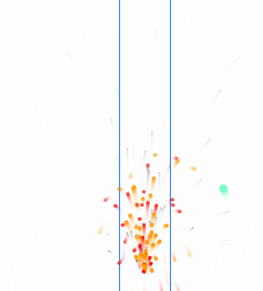

### Concepto
- En esta obra de arte generativo voy a implementar un sistema de partículas en el cual según los requerimientos, usará herencia, y polimorfismo. Al mismo tiempo el usuario podrá interactuar usando el micrófono para incrementar la potencia del sistema de partículas.


### Gestión de memoria
- Investigué la pregunta que me hice en la actividad anterior, de cómo hace p5.js para gestionar esto, ya que desde el códgio lo único que se veía es que se eliminaban de una lista a travez la cual se iteraba. Cuando busqué, efectivamente **P5.js** usa el _garbage collector_ de _JavaScript_ para gestionar su memoria. De esta manera, cuando el código deja de iterar a travez de un objeto _(En este caso una partícula que se elimina de la lista)_ este es elejible para la colección de basura y se libera el espacio de memoria de dicho objeto.


### Conceptos de unidades anteriores
- **Motion 101**: Como siempre, jugar con físcias es difertido, por lo que le adicionaré a las partículas un peso para poder hacer variacones en las interacciónes que implementaré. En particular haré una pelota con el que el usuario va a interactuar.
- A esta misma pelota también le añadiré un coeficiente de rebote para que no siempre rebote infinitamentey así su comportamiento cambie con el tiempo.
- También estaran lo que son cambios de entornos o zonas espefícias donde se aplican fuerzas diferentes.
- Por último, la escena empieza con un ```emitter``` y un ```ball```, cada uno va a aparecer en una posición aleatoria según una distribución Gaussiana, para que tiendan a aparecer en la mitad, pero no siempre.

### Idea inicial y boceto
- Como siempre, no me gusta inciiar con una idea ya muy plasmada en papel o muy contruida, me gusta ir jugando con el código e iterando a ver que sale interesante, por lo que al principio intenté hacer una especie de sistema de partículas que simulara un disparo. Esta idea no me terminó de entusiarmar mucho debido a lo poco interactuable para el usuaro, por lo que decidí que el sistema de partículas debía hacer algo más que ser vistoso, sino que también tuviera unteracción, así que mientras cambiaba las formas y el comportamiento de la partiula base, agarró la forma de una especie de erupción volcanica, por lo que decidí hacer una pequeña interacción para que el usuario pudiera mover una pelota en el entorno, usando la fuerza de la erupción, así terminando por dar la idea final. La pelota rebota dentro del **Canvas** y además aumenta su masa cada vez que rebota en el suelo. 

### Controles
- Usando el **Click Izquierdo** puedes cambiar la poscición de la erupción, o mejor dicho del ```emitter```, junto a este hay una zona de fuerza que empuja el objeto ```ball``` hacia arriba.
- Con la tecla **Espacio** puedes reinciar la simulación rápidamente.

### Simulación
- Códgio:
sketch.js
```js
// The Nature of Code
// Daniel Shiffman
// http://natureofcode.com

// Particles are generated each cycle through draw(),
// fall with gravity and fade out over time
// A ParticleSystem object manages a variable size
// list of particles.


let emitter;
let ball;
let timmer;
let time = 1;

//wind
let windForce;
let windHeight;
let windArea;
let startX;
let endX;
  
function setup() {
  createCanvas(640, 640);
  emitter = new Emitter(gaussianBetween(0, width), 450);
  ball = new Ball(gaussianBetween(0, width), 100, 5)
  
  //Wind
  windForce = createVector(0, -0.05);
  windArea = createVector(180, height);
  
}

function draw() {
  background(255, 255, 255, 55);

  drawWindLines();  // Debug Only

  emitter.addParticle();
  emitter.run();
  confineBall();
  ball.run();
  
  if(ball.position.x > startX && ball.position.x < endX){
    ball.applyForce(windForce);
    console.log("inside wind");
  }
}

function drawWindLines() {
  let areaWidth = 100; // Puedes ajustar este valor según lo que quieras
  startX = emitter.origin.x - areaWidth / 2;
  endX = emitter.origin.x + areaWidth / 2;

  stroke(0, 100, 255, 150);
  strokeWeight(2);
  line(startX, height, startX, height - windArea.y); // Línea izquierda
  line(endX, height, endX, height - windArea.y);     // Línea derecha

}

function confineBall() {
  if(ball.position.x > width){
    ball.velocity.mult(-1, 1);
  }
  else if(ball.position.x < 0){
    ball.velocity.mult(-1, 1);
  }
  else if(ball.position.y > height){
    ball.position.y = height - 1;
    ball.increaseMass();
    ball.velocity.mult(1, -0.8);
  }
  else if(ball.position.y < 0){
    ball.position.y = 1;
    ball.velocity.mult(1, -0.8);
  }
}

function gaussianBetween(min, max) {
  let mean = (min + max) / 2;
  let sd = (max - min) / 6; // ~99.7% de los valores caerán dentro del rango
  let val;
  do {
    val = randomGaussian(mean, sd);
  } while (val < min || val > max);
  return val;
}

function scaledForce(normalizedValue, minForce, maxForce) {
  // Asegura que el valor esté entre 0 y 1
  let n = constrain(normalizedValue, 0, 1);
  // Interpola entre min y max
  let magnitude = lerp(minForce, maxForce, n);
  return createVector(0, -magnitude); // ajusta dirección según tu simulación
}


function mousePressed(){
  emitter.followPosition(mouseX, mouseY);
}

function keyPressed() {
  if (keyCode === 32) {
    // Reiniciar el emitter y otros elementos si es necesario
    emitter = new Emitter(gaussianBetween(0, width), 450);
    ball = new Ball(gaussianBetween(0, width), 100, 5); // si tienes una pelota también
    console.log("Simulación reiniciada");
  }
}

```

particle.js
```js
// The Nature of Code
// Daniel Shiffman
// http://natureofcode.com

// Simple Particle System

// A simple Particle class

class Particle {
  constructor(x, y, m) {
    this.mass = m;
    this.position = createVector(x, y);
    this.velocity = createVector(random(-1, 1), random(-5, -1));
    this.acceleration = createVector(0, 0);
    this.lifespan = 255.0;
  }

  run() {
    let gravity = createVector(0, 0.05);
    this.applyForce(gravity);
    this.update();
    this.show();
  }

  applyForce(force) {
    this.acceleration.add(force);
  }

  // Method to update position
  update() {
    this.velocity.add(this.acceleration);
    this.position.add(this.velocity);
    this.lifespan -= 2;
    this.acceleration.mult(0);
  }

  // Method to display
  show() {
    stroke(0, this.lifespan);
    strokeWeight(0);
    fill(255, 150, 2,this.lifespan);

    circle(this.position.x, this.position.y, 8);
  }

  isDead() {
    return this.lifespan < 0.0;
  }
}

```

ball.js
```js
class Ball extends Particle {  
  
  // Override the show method
  show() {    

    stroke(0, this.lifespan);
    strokeWeight(0);
    fill(125, 255, 200,this.lifespan);

    circle(this.position.x, this.position.y, this.mass);

    this.lifespan = 255;
  }
  
  update() {
    this.velocity.add(this.acceleration);
    this.position.add(this.velocity);
    this.lifespan -= 2;
    this.acceleration.mult(0);
  }
  
  increaseMass() {
    this.mass = this.mass * 2;
    
    if(this.mass > 250){
      this.mass = 2;
    }
  }

}
```



### [Link de la simulación](https://editor.p5js.org/Adept-KeyCap/full/sn9i7ur8M)
